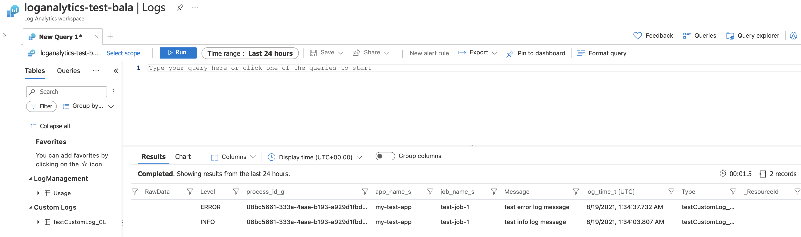

# Azure Custom Logging using Data collector - Python

### How to

```python
from az_custom_logging import AzCustomLogging

LOG_NAME = 'testCustomLog'
#processInfo => Optional
#   Pass any additional properties you want to log
#   this will create additional fields, so follow some standards.
processInfo = {
  'process_id': '<uuid>',
  'job_name': 'test-job-1'
}
cl = AzCustomLogging(
  customer_id='<Customer Id from Log Analytics Worksapce>',
  shared_key='<Shared key from Log Analytics Worksapce>',
  log_name=LOG_NAME, 
  process_info=processInfo
)

cl.log_info(message='test info log')

#To override existing process_info key for a specific log
cl.log_info(message='test info log, override job name', extra_args={'job_name': 'test-job-2'})
```

### How to - Async

```python
import asyncio
from az_custom_logging import AzCustomLoggingAsync

processInfo = {
  'process_id': '<uuid>',
  'job_name': 'test-job-1'
}
cl = AzCustomLoggingAsync(
  customer_id='<Customer Id from Log Analytics Worksapce>',
  shared_key='<Shared key from Log Analytics Worksapce>',
  log_name=LOG_NAME, 
  process_info=processInfo
)

#loop = asyncio.get_event_loop()
#loop.run_until_complete(cl.log_info(message='test info log 1'))

asyncio.run(cl.log_error(message='test info log 2'))
```

## Sample logs from my Custom log space


